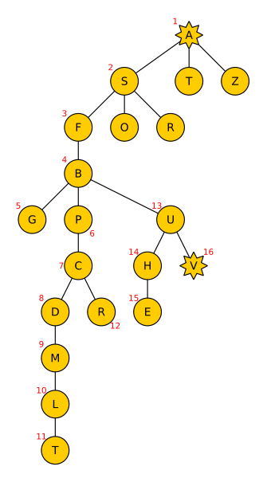
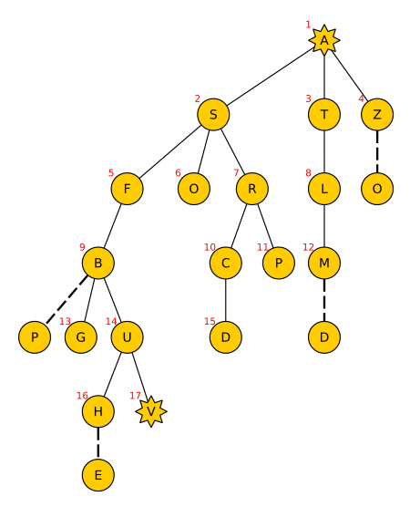
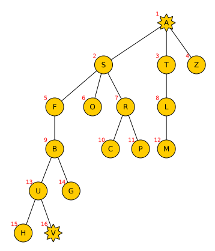
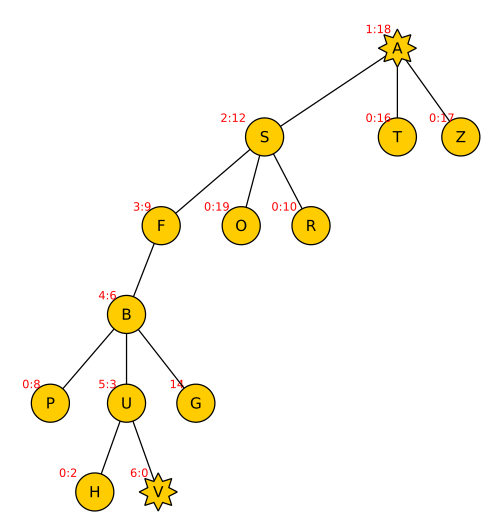

# CS 475 Assignment #2 - Ziad Arafat

1. $<\Sigma, Succ, S_0,G>$
   - Overview
      - While we might at first be tempted to treat this problem such that each agent has to search a path towards the other this will increase our branching factor by an entire degree. Instead of being $N$ where $N$ is the max outgoing paths of any city it will become $N^2$
        - So instead we can just find a route from agent $\alpha$'s starting point to agent $\beta$'s starting point.
          - If we are worried about finding a solution where the number of steps is distributed equally between the agents we can simply back track $T$ times where T is just the floor of the number of steps taken divided by 2.
      - So our formalization will be defined by finding a path from Arad to Vaslui.
   - $\Sigma$: Our set of possible states is defined by the list of cities in which our agent $\alpha$ could reside
     - let $X$ be a set of all cities in the map.
       - then $\Sigma=\{x \in X\}$
   - $Succ$: Our set of all possible successor transitions is defined by moving accross the paths from one city to the next.
     - Let $Succ=\{x\in \Sigma\times\Sigma\}$
   - $A$: our set of possible actions is dependant on what paths are available from a certain city.
     - If we are in Arad we can move to Zerind, Timisoara, or Sibiu.
     - We should only move to nodes we haven't visited yet.
     - The structure is $(r, d)$ where $r$ is the source city and $d$ is the destination city.
     - Each time we do an action we incur a cost of 1 or increment total steps by 1.
   - $S_0$: Our set of starting states is defined by the starting city of agent $\alpha$, which is Arad.
     - Let $S_0=\{A\}$
   - $G$: our set of goal states is defined by the city in which agent $\beta$ resides, which is vaslui.
     - Let $G=\{V\}$
   - The *forward branching factor* of our problem is defined by the maximum number of adjacent cities we can have at any state.
     - In our case this would be at Bucharest or Sibiu where we have 4 adjacent cities.
     - **Our Forward Branching factor is $4$**
   - In our problem we are optimizing for number of steps and are ignoring distance cost completely. All costs will be treated as a value of 1.

2. Solved Trees
   1. Depth First
      - 
   2. Breadth First
      - 
   3. Iterative Deepening
      - As expected we get the same result as Breadth first. The main difference is that we clear our space after we expand each level so the space complexity is less. Time complexity is the same.   
      - 
   4. A*
      - The format is (expansion order : h(n))
      - an expansion order of 0 means it wasn't expanded was just revealed.  
      -  

3. For A* search I based my heuristic on a distance tier list. 
   - I measured the relative distance of all the nodes to Vaslui using a paper and pencil to mark.
   - I ordered them from 19 to 0. 
     - 19 being the furthest node and 0 being Vaslui. When I compute the heuristic value I simple use the level from the list.
   - Since all the steps are the same cost to us there is no need to add a g(n).
   - The list is as follows 19 to 0 respectively. 
     - O, A, Z, T, L, D, M, S, C, R, F, P, G, B, N, E, U, H, I, V

